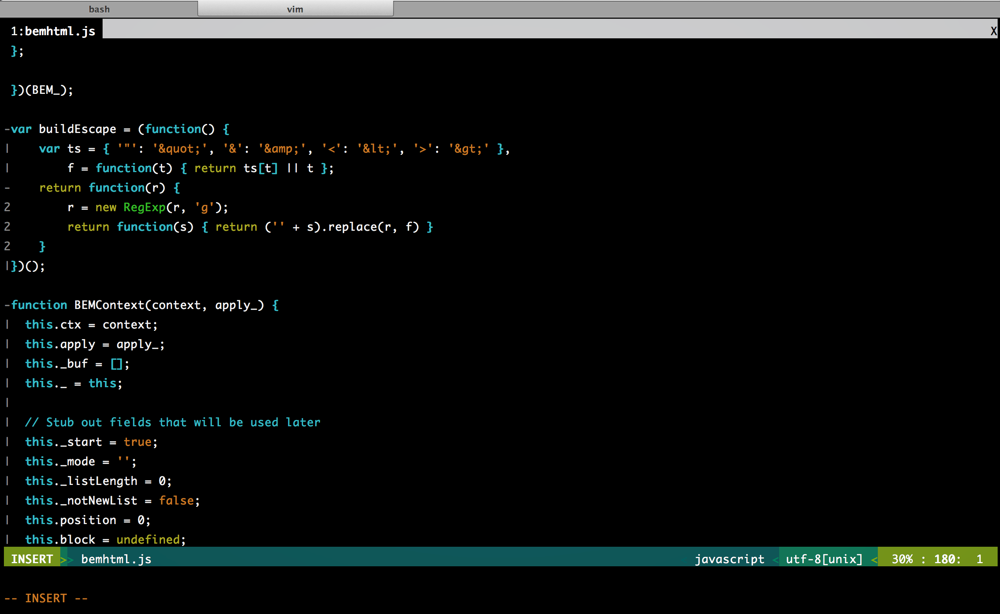
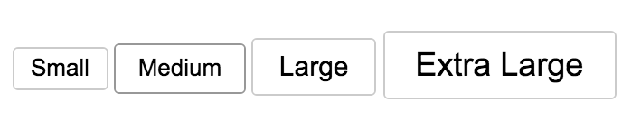

---

layout: ribbon

style: |

    #Cover h2 {
        margin:30px 0 0;
        color:#FFF;
        text-align:center;
        font-size:70px;
        }

    #Cover img {
        width: 100%
        }
---

# История создания БЭМ {#Cover}

## Верстка в Яндексе до 2006 года

    index.html
    about.html
    project.css
    project.js
    i/
        logo.png

## Начало 2006 года: появление блоков

Верстка первой Яндекс.Музыки и Ярушки: для сайтов с десятками разных страниц такой подход перестает работать.

**Блок** – это часть дизайна страницы или раскладки, определенная семантически или визуально.

## Префиксы

- *b-* block
- *с-* control
- *g-* global
- *-nojs* постфикс, для «включения» джаваскрипта блоков

## Элементы

    /* Head (begin) */
    .b-head { … }

        /* Logo (begin) */
            .b-head .logo { … }
            .b-head .logo a { … }
        /* Logo (end) */

## Зачатки общепортального фреймворка

    @import url(http://common.cloudkill.yandex.ru/css/global.css);
    @import url(http://common.cloudkill.yandex.ru/css/head/common.css);
    @import url(http://common.cloudkill.yandex.ru/css/static-text.css);

    /* Header (begin) */
        /* Service (begin) */
            .b-head .service h1 { … }
            .b-head .service h1, .b-head .service h1 a, .b-head .service h1 b { … }

## Первая сборка

Когда блоков много — такой поход замедляет загрузку страницы. Было принятно решение прекомпелировать стили перед выкладкой в продакшн: заменять каждый `@import` на содержимое внешних файлов.

Со временем сборщик вырос из простого perl-скрипта в открытый инструмент [borschik](https://ru.bem.info/tools/optimizers/borschik/).

## Правила блоков

- для описания элемента используется class, но не id;
- каждый блок имеет префикс;
- нет классов вне блоков.

## Простые и составные блоки

> В простые блоки нельзя вкладывать другие блоки, в составные — можно.*

Идея оказалась нерабочей, потому что завтра «простой» блок мог запросто становиться сложным.

> Любой блок должен позволять вкладывать в него другой блок, когда это возможно.*

## Правила полной независимости блоков

При включении блоков друг в друга они могут влиять друг на друга непредсказумым образом

- всем дом-элементам внутри блока надо задать классы, т.е. не опираться в CSS на имена элементов
- все классы, на которые накладываются стили этого блока, должны быть уникальными, например, начинаться с имени блока

## Модификаторы

Блок может выглядеть или вести себя немного по-разному, не теряя при этом своей сути.

## Общепортальный фреймворк: Лего 2.0

Смена парадигмы — **блоки первичны, технологии вторичны**

    common/
      block/
        b-head-logo/
          b-head-logo.css
          b-head-logo.xsl
          b-head-logo.js

## Декларация страницы

    <lego:page>
        <lego:l-head>
            <lego:b-head-logo>
                <lego:name/>
            </lego:b-head-logo>
        <lego:b-head-tabs type="search-and-content"/>

## Сборка без рук :)

Декларация страницы => список блоков => файлы всех технологий

    @import url(../../common/block/global/_type/global_reset.css);

    include("../../common/block/i-locale/i-locale.js");

    <xsl:import href="../../common/block/i-common/i-common.xsl"/>

## Стабилизация нотации

Блок `b-dropdown`

Элемент `b-dropdown__select`

Модификатор `b-dropdown_theme_green`

## БЭМ в наши дни

- [Организация на гитхабе](https://github.com/bem)
- [Открытая библиотека блоков](https://ru.bem.info/libs/bem-bl/dev/)
- [bem-tools](https://ru.bem.info/tools/bem/bem-tools/)
- [enb](https://github.com/enb-make/enb)
- [BEMHTML](https://ru.bem.info/technology/bemhtml/v2/intro/)
- [YATE](https://github.com/pasaran/yate)

## О чем еще можно рассказать

- Основные понятия БЭМ-методологии
- Соглашения по именованию (какие бывают, не только в Яндексе)
- Организация файловой системы
- Сборка БЭМ-проекта
- Какие бывают типичные проблемы, как БЭМ помогает их решать

## Материлы для этого доклада

- [https://ru.bem.info/method/history/](https://ru.bem.info/method/history/)
- [https://ru.bem.info/forum/-45/](https://ru.bem.info/forum/-45/)
- [https://ru.bem.info/forum/-46/](https://ru.bem.info/forum/-46/)
